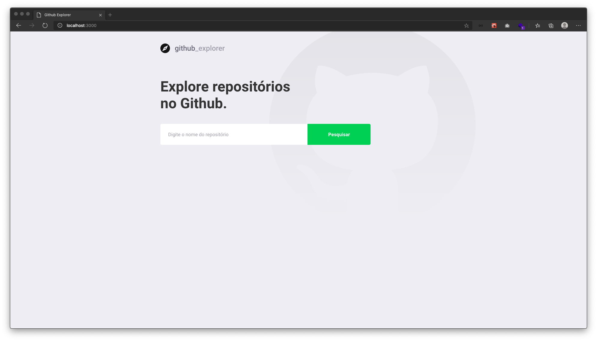
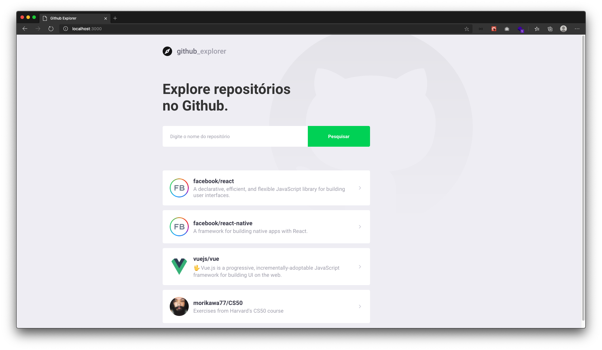
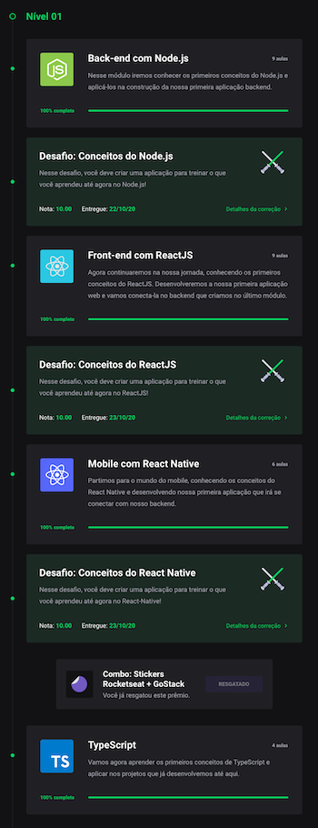

<h3 align="center">
  Bootcamp GoStack Modules | Level 01 - 06
</h3>

  

### 🚀 About Modules

In this repository you will follow my progress during classes from level 01 to 06.

### 📝 Anotations and other docs
<a target="_blank" rel="noopener noreferrer" href="https://www.notion.so/Rocketseat-Notes-about-Level-01-8ffdd35f253e4df4bfd3c2d1213d2fe1">Notes about level 01</a>

<a target="_blank" rel="noopener noreferrer" href="https://www.notion.so/Rocketseat-Notes-about-Level-02-c058ab7d2dc84f2089ffebbba21aa83d">Notes about level 02</a>

<a target="_blank" rel="noopener noreferrer" href="https://www.notion.so/Rocketseat-Typescript-c4c08685bd9e48ff803fb2bd5bd53244">Typescript</a>

<a target="_blank" rel="noopener noreferrer" href="https://www.notion.so/Rocketseat-Padr-es-de-projeto-com-ESLint-Prettier-e-EditorConfig-2a8b4fb0fa994a399d2ea2f1e751416d">Padrões de projeto com ESLint, Prettier e EditorConfig by #Rocketseat</a>

<a target="_blank" rel="noopener noreferrer" href="https://www.notion.so/Rocketseat-Repository-service-e-patterns-234ff675a604475bbbea358b468037ae">Repository, service e patterns by #Rocketseat</a>

<a target="_blank" rel="noopener noreferrer" href="https://www.notion.so/Rocketseat-Instalando-Docker-fd3680b445474bd2aaaba520290320e5">Instalando Docker</a>

<a target="_blank" rel="noopener noreferrer" href="https://www.figma.com/file/ZkYathhNkz0hriK2PWZNBC/Github-Explorer?node-id=0%3A1">Github Explorer Figma file</a>

<figure>

<figcaption>Github Explorer</figcaption>
</figure>

Github Explorer Null Error

Github Explorer Not Found Error

Github Explorer Listing Repos Saved on LocalStorage

Github Explorer Show Details and Issues List from Repo

### 📈 Level Results
Level 01 

Level 02 

Document in constant update.

---

Made with ❤️ by morikawa77
